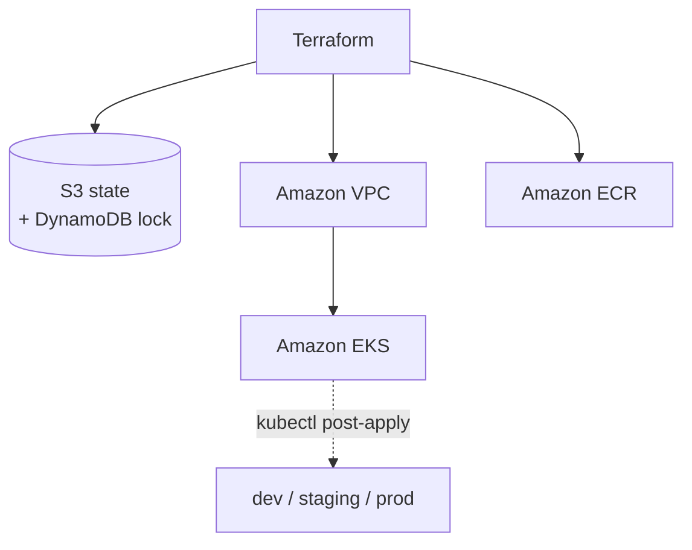

# Architecture

`taskflow-infra` provisions the AWS foundation for TaskFlow using Terraform. It is deliberately scoped to infrastructure only — no in-cluster Kubernetes resources — to keep provisioning deterministic and teardown clean.

## Components

- **Amazon VPC** — network boundary for the cluster, with public and private subnets across availability zones.
- **Amazon EKS** — the managed Kubernetes control plane and node capacity that runs all TaskFlow workloads.
- **Amazon ECR** — container registry for application images.
- **Remote state** — Terraform state in Amazon S3, with a DynamoDB table for state locking.

## Provisioning flow

## Key decisions

**Cluster and in-cluster resources are separated.** The EKS cluster is provisioned here; Kubernetes namespaces and workloads are applied afterward with `kubectl`. Combining both in a single Terraform apply causes DNS timing race conditions, because Terraform attempts to reach a control plane that isn't yet fully ready.

**LoadBalancers are torn down before the cluster.** Any in-cluster service of type LoadBalancer provisions an AWS ALB. If the cluster is destroyed while those services still exist, the orphaned ALBs remain attached to the VPC and block its teardown. They are deleted first, every time.

**Destroy-and-rebuild by default.** The cluster does not run idle. It is destroyed at the end of each session and rebuilt from this repo at the start of the next, keeping cost near zero between work sessions.

## Deployment boundaries

| Concern | Decision |
|---------|----------|
| Scope | Infrastructure only — no in-cluster resources |
| Namespaces | Created post-apply via `kubectl` |
| State | Amazon S3 + DynamoDB lock |
| Lifecycle | Destroy-and-rebuild per session |
| Region | `us-east-1` |
| Account | `713923090919` |